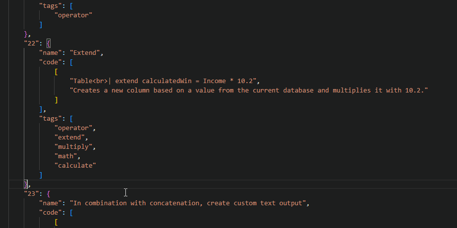

# Interactive KQL CheatSheet

Looking for a specific problem in KQL? Search for keywords of what you're looking for and gain insight into the presented queries by hovering the keywords and see their meaning at it's specific placement in that specific query.


## Contribute

To contribute to the KQL queries, you can use the "user-snippet" vscode included in this repo. The outermost element is a number or ID, which is being printed to the DOM in order from low to high. Put the snippet you want anywhere in the code, but please consider it kept somewhat organized. I have tried to keep the most simple queries at the beginning building up to more advanced towards the bottom. And for a future update these will be grouped (basic, intermediate, advanced and probably some large examples and specific use cases).

## Adding a new query
Use the user-snippet for VSCode included in the repo:
 

The JSON structure looks like this: 

```json
    {
        "name": "Name of the query",
        "code": [
        ["Hover me to get the explanation inside the next quotes visible", "I'm here!"],
        ["This allows for some HTML input as well, and mostly you'll need to break a line. Use <br> to do so.", "A line break is rendered."]
        ],
        "tags": ["These are search tags", "They Pop up when you ", "start typing"]
    } 
    
```