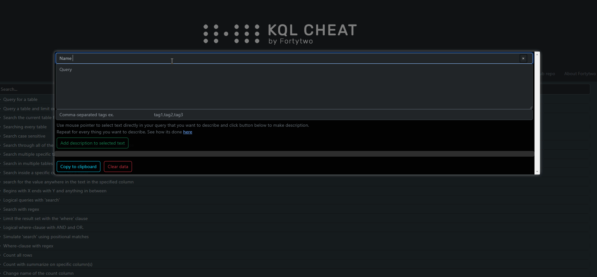

# Interactive KQL CheatSheet

Looking for a specific problem in KQL? Search for keywords of what you're looking for and gain insight into the presented queries by hovering the keywords and see their meaning at it's specific placement in that specific query.


## Contribute

We have done some effort to make it easier to contribute with relevant code with little to no knowledge of coding by creating a JSON template from GUI. Once on the [page](https://kqlcheat.byfortytwo.com/) click "Generate JSON". A window pops up. Fill in everything you need and mark the text you first want to write a description about, then click "add description to selected text". This will start to populate the JSON you need. Repeat the marking of the text selection ***from where you left off previous**, remember to mark lineshifts as well, because these will be converted to the correct HTML format in the background. Once you have marked and written about all the selections click the copy to clipboard button. Next up, you can paste the JSON into you local copy of the repo and do a pull request or even easier - add a issue with the JSON pasted in as comment - this gif shows the process. (Click the link in the text below the text inputs "here" to go directly to the git repo).





Another more manual approach to contribute to the KQL queries, is to use this "user-snippet" in vscode:

```json
{
	// Type "newKQL" to fill in a new query entry
	"NewKQL": {
		"scope": "JSON,javascript",
		"prefix": "newKQL",
		"body": [
			",{\n\t\"name\": \"\",\n\t\"code\": \n\t\t[\n\t\t\t[\n\t\t\t\t\"\", \n\t\t\t\t\"\"\n\t\t\t],\n\t\t\t[\n\t\t\t\t\"\", \n\t\t\t\t\"\"\n\t\t\t]\n\t\t],\n\t\"tags\": \n\t\t[\n\t\t\t\"\", \n\t\t\t\"\", \n\t\t\t\"\"\n\t\t]\n}",
			"$2"
		],
		"description": "Creates a new template JSON for inserting new code block"
	}
}
```

To use this snippet, click File -> Preferences -> Configure User Snippets and search for JSON. Paste the above code. When done, you can type the "prefix" keyword "newKQL" ant TAB to auto generate the new template for your KQL query.
